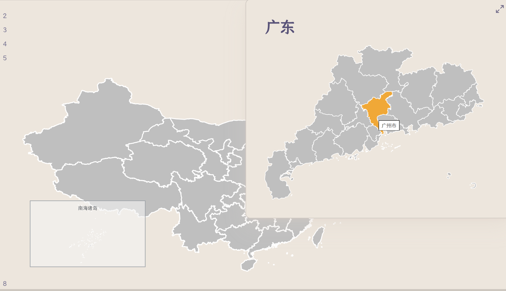
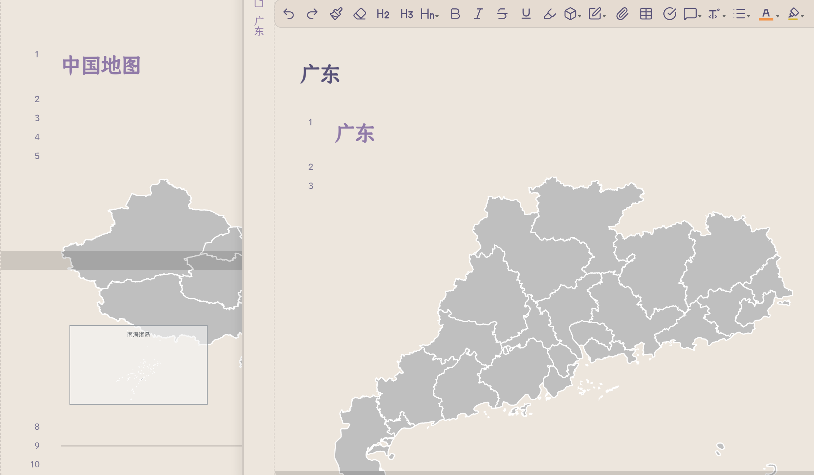

# Interactive Map（交互式地图）

在 Obsidian 笔记里嵌入可交互的 SVG 地图，实现**省 → 市 → 区县 层层下钻**：

- **悬浮高亮**：鼠标悬停时区域放大并变色
- **Ctrl+悬浮预览**：按住 Ctrl/Cmd 悬浮时弹出笔记的原生页面预览（和 wikilink 一样）
- **点击跳转**：点击区域跳转到对应笔记，笔记不存在可自动创建
- **层层下钻**：笔记里再嵌一张下级 SVG 地图，就能继续下钻；没有下级地图就是普通 md 笔记

---

## 快速开始

插件内置了一张**中国 34 省级行政区地图**（`china_provinces_map.svg` + `.json`），零配置即可使用。

1. 启用插件（设置 → 第三方插件 → 关闭安全模式 → 启用 Interactive Map）
2. 新建一篇笔记，写入：

~~~
```interactive-map
[[china_provinces_map.svg]]
```
~~~

3. 切换到**阅读视图**，即可看到地图：
   - 悬浮省份 → 放大变色 + 显示省名 tooltip
   - 按住 **Ctrl**（Mac 用 Cmd）悬浮 → 弹出该省笔记的页面预览
   - 点击省份 → 跳转到对应笔记（如 `北京.md`）



> 如果没有对应笔记，插件默认会提示。可在设置中开启「笔记不存在时自动创建」，并设置「默认笔记目录」。

---

## 使用自己的地图（省 → 市 → 区县层层下钻）

插件自带 `scripts/` 目录，包含两个 **Node.js 脚本**，用于从公开 GeoJSON 数据源生成符合插件格式的 SVG + JSON。

### 数据源

所有地图数据来自阿里 DataV 开放接口，免费、无需注册：

```
https://geo.datav.aliyun.com/areas_v3/bound/<adcode>_full.json
```

- `100000` = 中国（全国省级）
- `310000` = 上海（全市区级）
- `340000` = 安徽（全省市级）
- 其他 adcode 见下方表格

### 生成省级 / 市级地图

```bash
# 1. 下载 GeoJSON
# 以广东省为例，adcode=440000
curl -o 广东省.geojson "https://geo.datav.aliyun.com/areas_v3/bound/440000_full.json"

# 2. 运行生成脚本
node scripts/build_map.js 广东省.geojson 广东省

# 3. 产物：广东省.svg + 广东省.json（与 geojson 同目录）
```

### 生成中国地图

```bash
# 1. 下载中国 GeoJSON
curl -o china.geojson "https://geo.datav.aliyun.com/areas_v3/bound/100000_full.json"

# 2. 放到插件目录下，运行：
node scripts/build_china.js

# 产物：china_provinces_map.svg + china_provinces_map.json
# 中国地图会自动处理南海诸岛，生成左下角小图框
```

### 建立下钻链路

假设已有广东省.svg 和广东省.json（放在 vault 的附件目录如 `附件/maps/`）：

1. 建笔记 `广东.md`：
~~~
```interactive-map
[[广东省.svg]]
```
~~~

2. 在中国地图笔记中点击「广东」→ 跳转到 `广东.md`，看到广东省市级地图

3. 重复上述步骤：下载广州市 geojson（adcode=440100）→ 生成广州市.svg → 建 `广州市.md`

这样就能实现 **中国 → 广东 → 广州** 的层层下钻。



### 常用省级 adcode

| 省份 | adcode | 省份 | adcode | 省份 | adcode |
|------|--------|------|--------|------|--------|
| 北京 | 110000 | 上海 | 310000 | 天津 | 120000 |
| 重庆 | 500000 | 河北 | 130000 | 山西 | 140000 |
| 内蒙古 | 150000 | 辽宁 | 210000 | 吉林 | 220000 |
| 黑龙江 | 230000 | 江苏 | 320000 | 浙江 | 330000 |
| 安徽 | 340000 | 福建 | 350000 | 江西 | 360000 |
| 山东 | 370000 | 河南 | 410000 | 湖北 | 420000 |
| 湖南 | 430000 | 广东 | 440000 | 广西 | 450000 |
| 海南 | 460000 | 四川 | 510000 | 贵州 | 520000 |
| 云南 | 530000 | 西藏 | 540000 | 陕西 | 610000 |
| 甘肃 | 620000 | 青海 | 630000 | 宁夏 | 640000 |
| 新疆 | 650000 | 台湾 | 710000 | 香港 | 810000 |
| 澳门 | 820000 | | | | |

> 市级 adcode 可在 DataV 上按层级查看，或从省级 GeoJSON 的 `features[].properties.adcode` 获取。

---

## SVG 格式约定

如果你想手写 SVG 或从其他来源制作地图，只需满足以下约定：

1. 每个区域是一个元素（`<path>` / `<polygon>` / `<rect>` …），class 中包含 `state <slug>`
2. 区域元素**内嵌** `<title>中文名</title>` 作为 tooltip
3. ⚠️ **不要**在 `<svg>` 根下放 `<title>`，否则所有区域都会显示同一个名
4. 同名 `.json` 侧车将 slug 映射到笔记名：

```json
{
  "regions": {
    "440100": "广州市",
    "440300": "深圳市"
  }
}
```

完整示例：

```xml
<svg xmlns="http://www.w3.org/2000/svg" viewBox="0 0 4 3" preserveAspectRatio="xMidYMid meet">
  <g>
    <path class="state 440100" fill="#BFBFBF" fill-rule="evenodd" stroke="#fff" stroke-width="0.01" d="M...Z">
      <title>广州市</title>
    </path>
    <path class="state 440300" fill="#BFBFBF" fill-rule="evenodd" stroke="#fff" stroke-width="0.01" d="M...Z">
      <title>深圳市</title>
    </path>
  </g>
</svg>
```

- slug 推荐用 **6 位 adcode**（唯一、不依赖拼音）
- 笔记名匹配 `.json` 侧车中定义的中文名
- 插件查找笔记的顺序：`默认笔记目录/区域名` → 全库按文件名解析

---

## 设置

| 设置项 | 默认值 | 说明 |
|--------|--------|------|
| 悬浮放大倍数 | `1.08` | 鼠标悬浮时区域缩放比例 |
| 悬浮颜色 | `#f5a623` | 鼠标悬浮时的填充颜色 |
| 默认笔记目录 | （空） | 例 `Project/MAP`，点击区域后在该目录查找/创建笔记 |
| 笔记不存在时自动创建 | 关闭 | 开启后，点击无对应笔记的区域会自动新建 |
| 在新标签页打开 | 关闭 | 开启后点击区域在新标签页打开笔记 |

---

## 快捷键与命令

- **Ctrl/Cmd + 悬浮**：弹出页面预览（依赖核心插件「页面预览」）
- 命令面板 →「插入交互式地图代码块」：快速插入 ```interactive-map``` 骨架
- 支持**拖拽 SVG 文件**到编辑器：自动插入交互式地图代码块（而非默认图片嵌入）

---

## 小贴士

- 改了 SVG 或 .json 后，需要**重新渲染笔记**（切到源码模式再切回阅读视图，或重开笔记）。插件按 mtime 缓存 SVG 文本。
- 改了 main.js 需要**重载插件**（设置 → 第三方插件 → 关再开）。
- 大地图（如中国省级）按 mtime 做文本缓存，重复渲染不重复读盘。
- 侧车 `.json` 里的中文名建议用**短名**（北京而非北京市、广西而非广西壮族自治区），匹配既有笔记。
